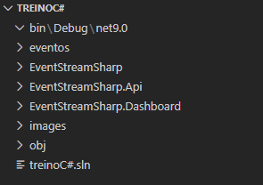
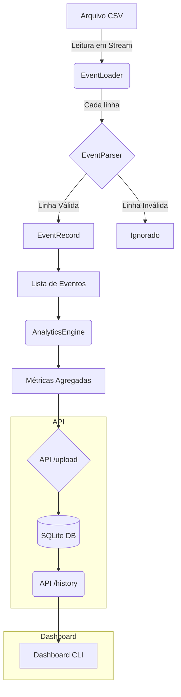
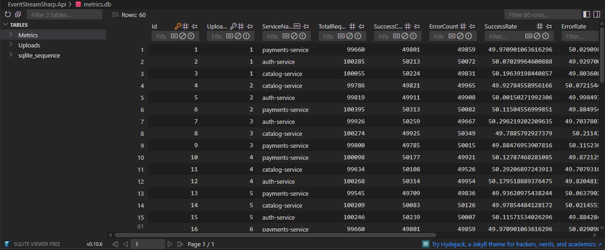
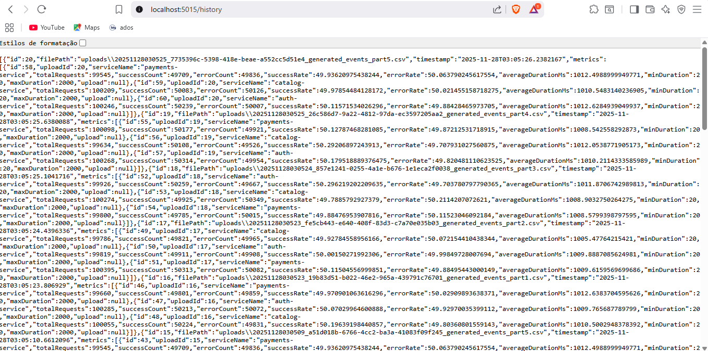
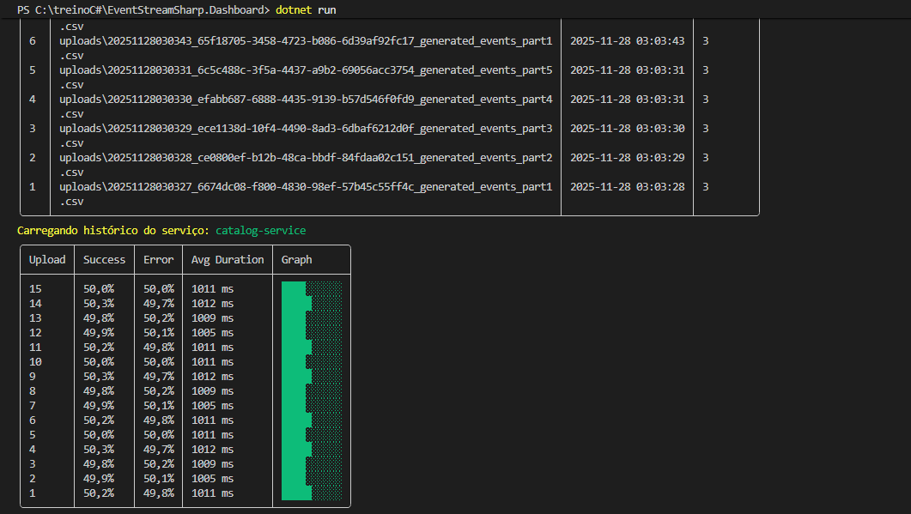
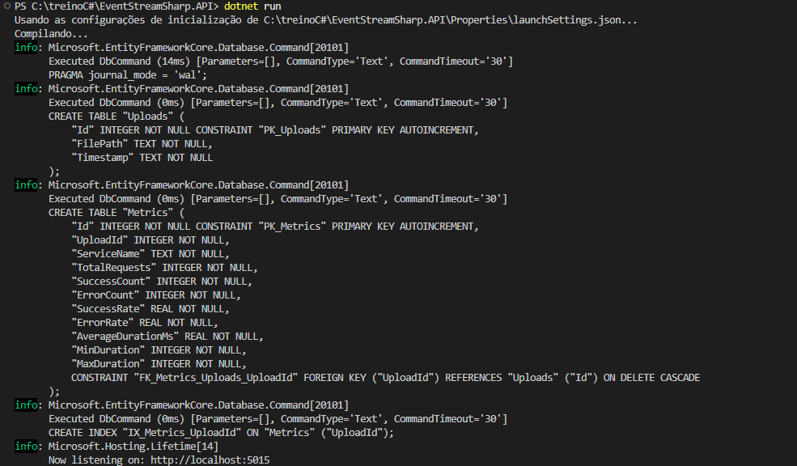

# EventStreamSharp

[](https://dotnet.microsoft.com/) [](./EventStreamSharp.Tests/)

**Um pipeline de ingestão e processamento de eventos de alto volume, construído em C# para simular os desafios de Engenharia de Dados e SRE em um ambiente de microsserviços.**

---

## 📜 Visão Geral

O EventStreamSharp simula um ecossistema de observabilidade, realizando as tarefas diárias de equipes de SRE e Engenharia de Dados:

-   **Ingestão:** Coleta e valida milhões de eventos a partir de arquivos CSV.
-   **Processamento:** Agrega dados e extrai métricas de saúde dos serviços em tempo real.
-   **Persistência:** Armazena o histórico de uploads e as métricas calculadas em um banco de dados SQLite.
-   **Visualização:** Fornece uma interface de linha de comando (CLI) para visualizar a saúde histórica e atual dos serviços.

## 🔥 Motivação

> Em sistemas distribuídos modernos, um único serviço pode gerar milhões de eventos por minuto. Como podemos processar esse volume de forma eficiente, extrair insights e garantir a resiliência do sistema mesmo quando os dados estão corrompidos?

Este projeto nasceu como uma resposta a essa pergunta e com um objetivo claro: **aprender C# do zero e construir um bom projeto de portfólio baseado em casos reais .**

O foco foi exercitar habilidades essenciais de mercado:
-   Processamento de alto volume de dados (Big Data).
-   Design de um sistema resiliente a falhas e dados "sujos".
-   Extração e agregação de métricas de performance (telemetria).
-   Organização de código modular, seguindo princípios de Clean Architecture.
-   Criação de APIs RESTful e clientes de linha de comando.
-   Implementação de testes unitários para garantir a qualidade.

## 🏛️ Arquitetura

A solução segue princípios de **Clean Architecture "lite"**, com uma clara separação entre a lógica de negócio (Core) e as camadas externas (API, UI), garantindo baixo acoplamento e alta testabilidade.

### Estrutura de Projetos


### Fluxo de Dados


---

## ✨ Features e Detalhes Técnicos

### Parsing Robusto e de Alta Performance
O coração do projeto é um parser construído para ser resiliente e eficiente:
- **Streaming de Arquivos:** `File.ReadLines` é usado para processar arquivos gigantes com uso mínimo e constante de memória.
- **Validação Segura:** Ignora linhas inválidas sem quebrar o pipeline. Utiliza `DateTime.TryParse`, `int.TryParse` com `NumberStyles` e parsing de booleans customizado para evitar exceções com dados malformados.
- **Limpeza de Dados:** Remove caracteres indesejados como o BOM (Byte Order Mark) `\uFEFF` e múltiplos `\r\n`.

### Processamento e Agregação com LINQ
O `AnalyticsEngine` usa o poder do LINQ para agregar milhões de eventos de forma declarativa e eficiente:
- `GroupBy(e => e.ServiceName)` para agrupar todos os eventos por serviço.
- `Count()` com predicados para calcular sucessos e erros.
- `Average()`, `Max()`, e `Min()` para calcular estatísticas de duração.

### Persistência com SQLite
Todas as métricas e informações de upload são persistidas em um banco de dados **SQLite** local através do **Entity Framework Core**. Isso garante que os dados históricos permaneçam disponíveis entre as execuções da aplicação.


*Visualização das tabelas `Uploads` e `Metrics` em um cliente SQLite.*

### API RESTful com .NET
A API expõe endpoints claros para interagir com o sistema:

| Verbo  | Endpoint           | Descrição                                         |
|--------|--------------------|---------------------------------------------------|
| `POST` | `/upload`          | Envia um arquivo CSV para processamento e salvamento. |
| `GET`  | `/stats`           | Retorna métricas do último arquivo processado.      |
| `GET`  | `/stats/{service}` | Filtra as métricas de um serviço específico.        |
| `GET`  | `/history`         | Lista todos os uploads já realizados.             |
| `GET`  | `/history/{service}`| Retorna o histórico de métricas de um serviço.      |

### Dashboard Interativo
Uma CLI construída com **Spectre.Console** que atua como uma mini-plataforma de observabilidade, com:
- Tabelas de histórico bem formatadas.
- Seleção interativa de serviços para detalhamento.
- Gráficos de barra (`Sparkline`) para visualização rápida da taxa de sucesso.


*Visualização do histórico de uploads no terminal.*


*Visualização de métricas detalhadas para um serviço específico.*

---

## ✅ Testes Automatizados

A qualidade do código é garantida por uma suíte de testes unitários com **xUnit**.

- **Cobertura de Cenários:** Os testes validam tanto o "caminho feliz" (parsing de linhas válidas) quanto o "caminho triste" (parsing de linhas inválidas), garantindo que dados inconsistentes nunca quebrem a aplicação.
- **Padrão AAA:** Os testes são estruturados no padrão *Arrange-Act-Assert* para máxima clareza.

```csharp
[Fact]
public void Parse_ComLinhaInvalida_DeveRetornarNulo()
{
    // Arrange: Prepara um parser e uma linha de CSV com campos faltando.
    var parser = new EventParser();
    var linhaCsvInvalida = "2025-11-28T10:00:00Z,auth-service,login,120";

    // Act: Executa o método de parsing.
    var resultado = parser.Parse(linhaCsvInvalida);

    // Assert: Verifica se o resultado é nulo, como esperado.
    Assert.Null(resultado);
}
```

---

## 🛠️ Exemplos de Desafios Reais Encontrados e Soluções

Durante o desenvolvimento, vários problemas reais surgiram. A solução deles demonstra um processo de engenharia maduro.

1.  **Bug: Métricas não eram salvas no banco de dados.**
    -   **Causa:** Faltava uma propriedade de navegação (`public UploadEntity Upload`) na entidade `ServiceMetricEntity`, impedindo o Entity Framework de relacionar as tabelas corretamente.
    -   **Solução:** Adicionar a propriedade para estabelecer um relacionamento bidirecional explícito.

2.  **Bug: API retornava erro 500 ao consultar o histórico.**
    -   **Causa:** A correção anterior criou um ciclo de referência ( `Upload` -> `Metrics` -> `Upload` ...), causando uma exceção durante a serialização para JSON.
    -   **Solução:** Configurar o serializador JSON no `Program.cs` para ignorar ciclos.
        ```csharp
        builder.Services.Configure<JsonOptions>(options => {
            options.SerializerOptions.ReferenceHandler = ReferenceHandler.IgnoreCycles;
        });
        ```

3.  **Problema: Uploads de arquivos gigantes falhavam.**
    -   **Causa:** O limite padrão do Kestrel para o tamanho do corpo da requisição era muito pequeno.
    -   **Solução:** Aumentar o limite no `Program.cs`.
        ```csharp
        builder.WebHost.ConfigureKestrel(o => o.Limits.MaxRequestBodySize = 1_000_000_000);
        ```

---

## 🚀 Como Executar o Projeto

1.  **Clone o repositório.**
2.  **Abra dois terminais** na pasta raiz do projeto.

**Terminal 1: Iniciar a API**
```shell
cd EventStreamSharp.Api
dotnet run
```
A API estará rodando e ouvindo em `http://localhost:5015`.



**Terminal 2: Iniciar o Dashboard**
```shell
cd EventStreamSharp.Dashboard
dotnet run
```
O dashboard irá iniciar, enviar os arquivos CSV da pasta `/eventos` para a API e exibir o histórico.

**Para rodar os testes:**
```shell
dotnet test
```

## 💭 Considerações Finais

O EventStreamSharp é mais do que um simples projeto: é uma demonstração prática de um pipeline de dados realista, desde a ingestão resiliente até a visualização de métricas e testes automatizados. Ele reflete um processo de aprendizado rápido e disciplinado, resultando em uma solução com arquitetura sólida e boas práticas.
